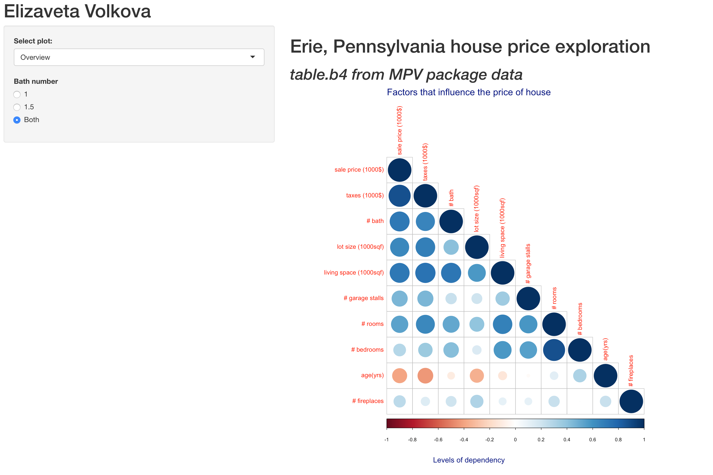
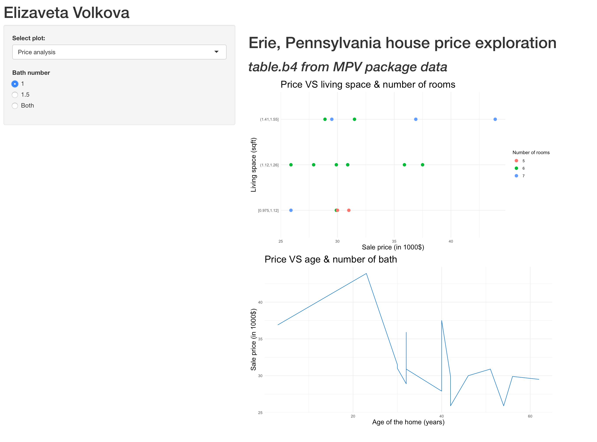
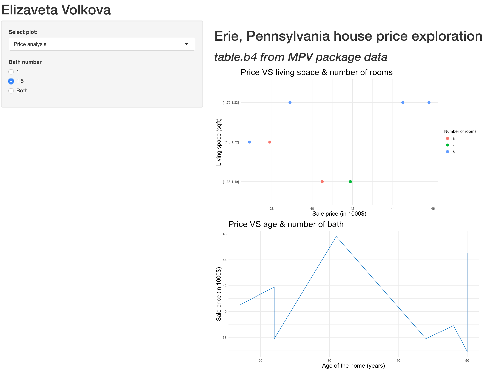
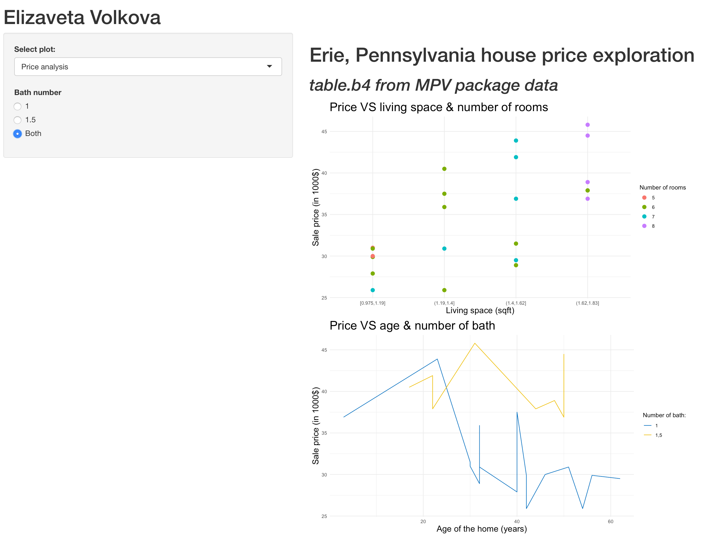
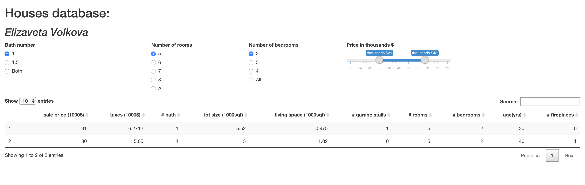
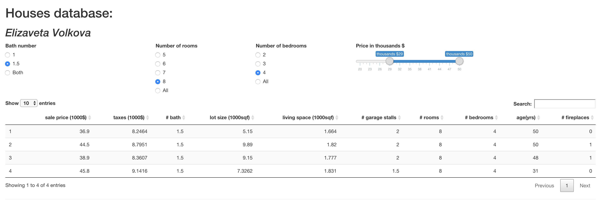
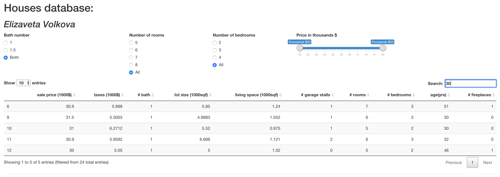

# Apps Description:

#### Aim:

Perform & Present the Analysis of House Pricing based on the house parameters (number of baths, number of rooms, number of bedrooms, living space etc.).

#### Dataset:

Table.b4 data from R MPV Package.

The Data Consists of 24 property evaluations of houses in Erie, Pennsylvania 1977.

#### Public:

Realtors from one of the Erie, Pennsylvania realtor agencies.

#### ShinyApps:

**House Pricing**:

The app illustrates:

1. Correlations between different houses parameters

2. Prices distribution for different bath options

##### Screenshots:

**Houses Database**:

The app contains the database with all the presented houses and allows different filtering options by:

1. Bath number

2. Number of rooms

3. Number of bedrooms

4. Price in 1000$

##### Screenshots:

